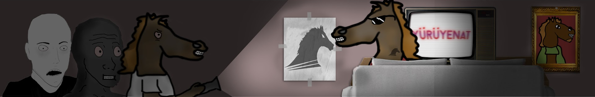

# 🎮 YürüyenAT Studios — Resmi Web Sitesi

YürüyenAT YouTube kanalının bağımsız video, dublaj, machinima ve oyun arşivi web sitesi.



---

## 🌟 Özellikler

- **Modern Single-Page Mimarisi:** Temiz, hızlı ve responsive HTML5 yapısı.
- **Dinamik Canlı YouTube Kataloğu:** GTA dublajları, GMod kaosları, Minecraft maceraları ve Co-op oyun videoları.
- **Kategori Filtreleme:** Vanilla JS ile anlık ve akıcı video filtreleme.
- **Otomatik & Manuel Light/Dark Mode:** CSS custom properties ve `prefers-color-scheme` destekli, animasyonlu tema değiştirme butonu.
- **Yüksek Kontrast ve Modern Tipografi:** Google Fonts (`Space Grotesk` + `Outfit`) ile özel tasarım dili.
- **Hafif & Bağımsız:** Sıfır ağır kütüphane bağımlılığı (JQuery, Bootstrap vb. yok).

---

## 🚀 Yerel Geliştirme

Projeyi yerel ortamınızda görüntülemek için herhangi bir statik sunucu kullanabilirsiniz:

```bash
# Python ile yerel sunucu başlatma:
python3 -m http.server 8000
```

Tarayıcınızda `http://localhost:8000` adresini açarak siteyi görüntüleyebilirsiniz.

---

## 📺 Bağlantılar

- **YouTube Kanalı:** [youtube.com/@YürüyenAt](https://www.youtube.com/@Y%C3%BCr%C3%BCyenAt)
- **Telif Hakkı:** *Telif hakkı yok, ne telifi oğlumm.*
